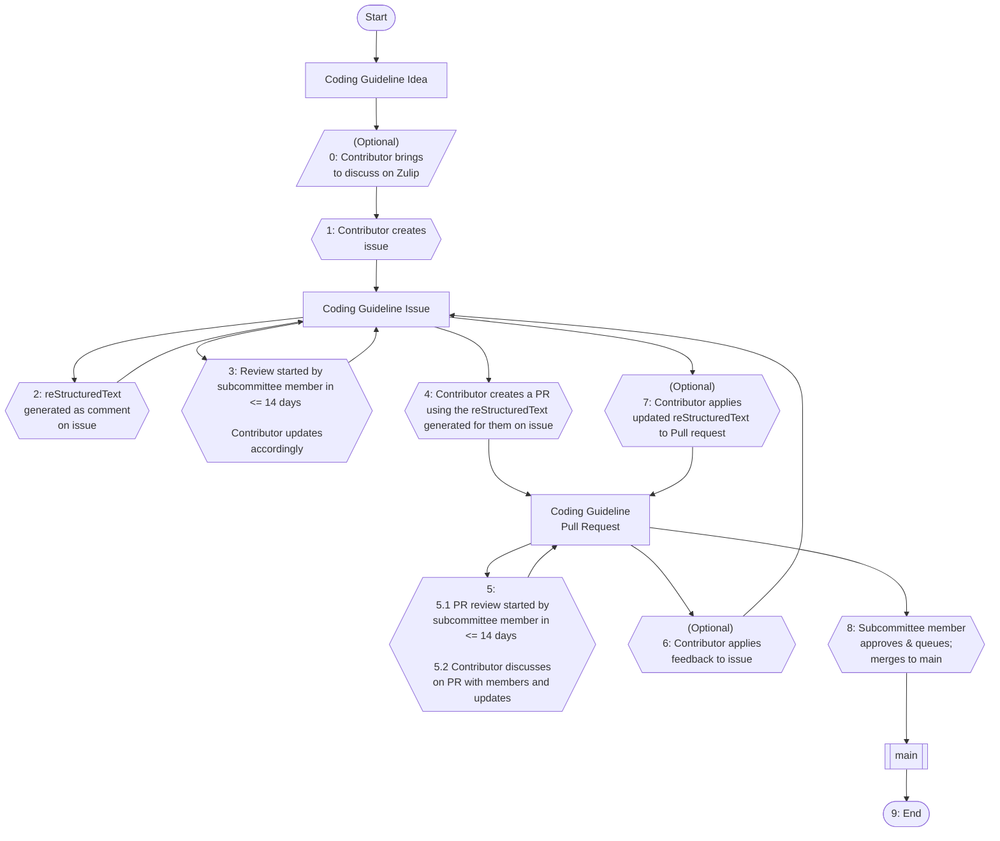

# Contributing to the coding guidelines

## Table of Contents

- [Contributing to the coding guidelines](#contributing-to-the-coding-guidelines)
  - [Table of Contents](#table-of-contents)
  - [Contribution Workflow](#contribution-workflow)
    - [Note on Chapter Layout](#note-on-chapter-layout)
    - [0) Bring up the idea for discussion](#0-optional-bring-the-idea-up-for-discussion)
    - [1) Submit coding guideline issue](#1-submit-coding-guideline-issue)
      - [1.1) Finding the FLS ID](#11-finding-the-fls-id)
    - [2) Guideline Generated as a Comment](#2-guideline-generated-as-a-comment)
    - [3) Create a Draft with a Member](#3-create-a-draft-with-a-member)
    - [4) Create the PR](#4-create-the-pr)
    - [5) Iterate on Feedback](#5-iterate-on-feedback)
      - [5.1) Member Begins Review](#51-member-begins-review)
      - [5.2) Update the PR Based on Feedback](#52-update-the-pr-based-on-feedback)
    - [6) Contributor Applies Feedback on Issue](#6-contributor-applies-feedback-on-issue)
    - [7) Contributor Applies Regenerated Guideline to PR](#7-contributor-applies-regenerated-guideline-to-pr)
    - [8) Your Guideline gets merged](#8-your-guideline-gets-merged)
    - [You just contributed a coding guideline!](#you-just-contributed-a-coding-guideline)
  - [Writing a guideline locally (less typical, not recommended)](#writing-a-guideline-locally-less-typical-not-recommended)
    - [Guideline template](#guideline-template)
  - [Before You Begin Contributing](#before-you-begin-contributing)
    - [Licenses](#licenses)
    - [Code of Conduct](#code-of-conduct)
  - [Contribution Process](#contribution-process)
    - [Issues](#issues)

## Contribution Workflow

Here's a diagram of the overall process:



### Note on Chapter Layout

The Safety Critical Rust Coding guidelines has the same chapter layout as the [Ferrocene Language Specification](https://spec.ferrocene.dev/) (FLS). If you would like to contribute a new guideline, find a section from the FLS that interests you, then write a guideline in the corresponding chapter of these coding guidelines.

### 0) (Optional) Bring the idea up for discussion

Have an idea for a coding guideline? Want to discuss it?

If you want to discuss the feasibility of a guideline or discuss it with others to ensure it's not too similar an existing guideline, drop by the [Safety-Critical Rust Consortium's Zulip stream](https://rust-lang.zulipchat.com/#narrow/channel/445688-safety-critical-consortium) and open a new topic.

### 1) Submit coding guideline issue

To add a new coding guideline, open a [coding guideline issue](https://github.com/rustfoundation/safety-critical-rust-coding-guidelines/issues/new?template=CODING-GUIDELINE.yml).

#### 1.1) Finding the FLS ID

Note that the FLS ID should be filled according to the FLS paragraph ID for which the guideline is covering. One way to go about finding this is to inspect the page using your web browser. You'll be looking for something like:


```html
<p><span class="spec-paragraph-id" id="fls_4rhjpdu4zfqj">4.1:1</span>
```

You would then pull `fls_4rhjpdu4zfqj` to place in the FLS ID field.


### 2) Guideline Generated as a Comment

A GitHub Action will fire, adding a comment to your newly created issue with
the contents of the coding guideline prepared written out correctly
in reStructuredText.

Note that if you later update the body of the coding guideline issue this will
fire the GitHub Action again and update the original comment with the new
contents converted to reStructuredText.

### 3) Create a Draft with a Member

Within 14 days of your submission, a member of the Coding Guidelines Subcommittee should give you a first review. You'll work with them (and other members) to flesh out the concept and ensure the guideline is well prepared for a Pull Request.

When a subcommittee member adds the `sign-off: create pr` label, the issue review is considered complete and reviewer reminders stop.

### 4) Create the PR

> [!NOTE]
> Here's a list of recommended prerequisites that shall be fulfilled before turning an issue into a PR:
>
> * The new rule isn't already covered by another rule
>     * OR, in case there is(are) already another rule(s),
>     * The existing rule(s) need(s) to be linked to the new rule,
>     * AND the new rule needs to link to the existing rule(s).
> * All sections contain some content
> * Content written may be *incomplete*, but must not be *incorrect*
> * `🧪 Code Example Test Results` section shows all example code compiles

As soon as these prerequisites are fulfilled, the draft shall be marked as PR-ready by a subcommittee member, by labeling the issue with `sign-off: create pr`. This denotes that you should create a Pull Request with your Guideline. Further discussion about the amount and correctness of its content shall then be done on the Pull Request itself.

The contents of the PR should be based on the bot comment containing the generated RST form of your guideline, as seen in [Step 2](#2-guideline-generated-as-a-comment). The comment has the exact file content you'll need.

In order to ensure your guideline appears when rendering the document, reference the generated comment from [Step 2](#2-guideline-generated-as-a-comment). All the steps necessary should appear below the headings `📁 Target Location` and `🗂️ Update Chapter Index`.

Make sure to include this command in the body of your PR, where `xyz` is the number of the issue you opened in [Step 1](#1-submit-coding-guideline-issue):

> `closes #xyz`

This will ensure issue `#xyz` is closed when your Pull Request gets merged.


### 5) Iterate on Feedback

#### 5.1) Member Begins Review

The generated Pull Request may attract additional feedback or simply be an easier place to suggest targeted edits.

As the contributor of the coding guideline and opener of the issue, you'll respond to comments, discuss, all the normal things on the pull request.

Review comments or changes requested by the assigned reviewer reset the 14-day timer. When the assigned reviewer approves the PR, the review is marked complete and reminders stop.

#### 5.2) Update the PR Based on Feedback

If you agree with the suggested changes, you've got two options:

- Iterate directly on the Pull Request, if you're comfortable with reStructuredText to do so
- If you'd rather make revisions in Markdown, you can return to the issue
  from [1) Submit coding guideline issue](#1-submit-coding-guideline-issue)
  to regenerate the reStructured Text guideline form by following steps
  outlined in
  [6) Contributor Applies Feedback on Issue](#6-contributor-applies-feedback-on-issue)
  and
  [7) Contributor Applies Regenerated Guideline to PR](#7-contributor-applies-regenerated-guideline-to-pr)

### 6) Contributor Applies Feedback on Issue

(Optional, if not comfortable with reStructured Text from
[5.2) Update the PR Based on Feedback](#52-update-the-pr-based-on-feedback))

The contributor edits the body of the issue summary, reflecting suggestions and then saves it.
You will then momentarily see a new comment added to the issue containing the updated
guideline content written in reStructured Text.

### 7) Contributor Applies Regenerated Guideline to PR

(Optional, if not comfortable with reStructured Text from
[5.2) Update the PR Based on Feedback](#52-update-the-pr-based-on-feedback))

The contributor then copy + pastes the contents of the guideline from
[6) Contributor Applies Feedback on Issue](#6-contributor-applies-feedback-on-issue)
and overwrites the contents of their feature branch, so that the feedback is
reflected into the Pull Request.

### 8) Your Guideline gets merged

Once the coding guideline contents have passed review, a subcommittee member will approve the pull request, and put it on the merge queue to be merged.

### You just contributed a coding guideline!

That's it!


## Writing a guideline locally (less typical, not recommended)

While it is possible to create guidelines locally, we encourage contributors to make use of the process described above since it handles some of the fiddly details for you as a guideline writer.

### Guideline template

We have a script `./generate_guideline_templates.py` which assumes you're using `uv` that can be run to generate the template for a guideline with properly randomized IDs.

You can the copy and paste this guideline from the command line into the correct chapter.

## Before You Begin Contributing

### Licenses

There is no Contributor License Agreement to sign to contribute this project. 
Your contribution will be covered by the license(s) granted for this 
repository, commonly MIT, Apache, and/or CC-BY, but could be a different 
license. In other words, your contribution will be licensed to the Foundation 
and all downstream users under those licenses. You can read more in the 
Foundation's [intellectual property policy][ip-policy].

### Code of Conduct

Please review and adhere to the [code of conduct](CODE_OF_CONDUCT.md) before 
contributing any pull requests.

## Contribution Process

All submissions, including submissions by project members, require review. We
use GitHub pull requests for this purpose. Consult [GitHub Help][pull-requests] 
for more information on using pull requests.

### Issues

Do you just want to file an issue for the project? Please do so in GitHub under 
the `Issues` tab.

[ip-policy]: https://foundation.rust-lang.org/policies/intellectual-property-policy/
[pull-requests]: https://help.github.com/articles/about-pull-requests/
