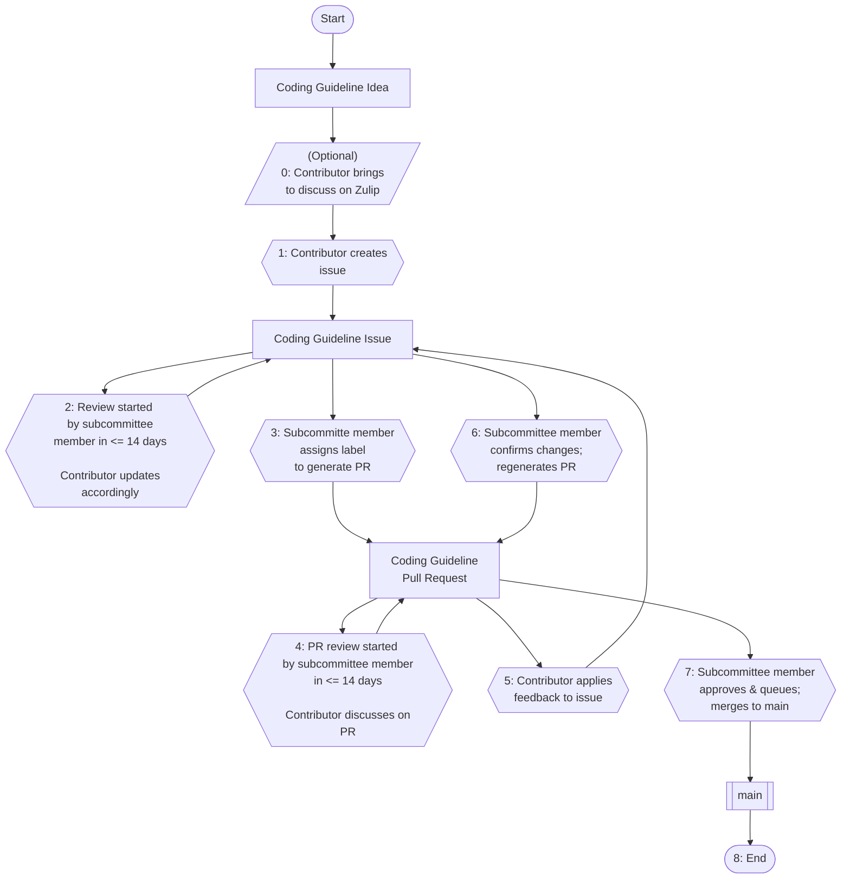

# Contributing

## Contributing to a Rust Foundation Project

Thank you for your interest in contributing to this Rust Foundation project. 
We are happy and excited to review and accept your pull requests.

## Table of Contents

- [Contributing to the coding guidelines](#contributing-to-the-coding-guidelines)
   - [Diagram for contribution workflow](#diagram-for-contribution-workflow)
   - [0. Have an idea for a coding guideline? Want to discuss it?](#0-have-an-idea-for-a-coding-guideline-want-to-discuss-it)
   - [Preamble: chapter layout mirrors Ferrocene Language Specification](#preamble-chapter-layout-mirrors-ferrocene-language-specification)
   - [1. Submit coding guideline issue](#1-submit-coding-guideline-issue)
   - [1.a Finding the FLS ID](#1a-finding-the-fls-id)
   - [2. A subcommittee member reviews the coding guideline issue, works with you the contributor](#2-a-subcommittee-member-reviews-the-coding-guideline-issue-works-with-you-the-contributor)
   - [3. A pull request is generated from the coding guideline issue](#3-a-pull-request-is-generated-from-the-coding-guideline-issue)
   - [4. Contributor responds to feedback given on pull request](#4-contributor-responds-to-feedback-given-on-pull-request)
   - [5. Contributor applies updates to coding guidelines issue](#5-contributor-applies-updates-to-coding-guidelines-issue)
   - [6. A subcommittee member generates new pull request contents from coding guidelines issue](#6-a-subcommittee-member-generates-new-pull-request-contents-from-coding-guidelines-issue)
   - [7. A subcommittee member merges the coding guideline pull request](#7-a-subcommittee-member-merges-the-coding-guideline-pull-request)
   - [8. You contributed a coding guideline](#8-you-contributed-a-coding-guideline)
- [Writing a guideline locally (less typical, not recommended)](#writing-a-guideline-locally-less-typical-not-recommended)
   - [Guideline template](#guideline-template)
- [Before You Begin Contributing](#before-you-begin-contributing)
   - [Licenses](#licenses)
   - [Code of Conduct](#code-of-conduct)
- [Contribution Process](#contribution-process)
   - [Issues](#issues)

## Contributing to the coding guidelines

See [CONTRIBUTING.md](CONTRIBUTING.md).

### Diagram for contribution workflow



### 0. Have an idea for a coding guideline? Want to discuss it?

While not mandatory, sometimes you'd like to check into the feasiblity of a guideline or discuss it with others to ensure it's not overlapping an existing guideline. Feel free to drop by the Safety-Critical Rust Consortium's Zulip stream: [here](https://rust-lang.zulipchat.com/#narrow/channel/445688-safety-critical-consortium). Please open a new topic per coding guideline you'd like to discuss.

### Preamble: chapter layout mirrors Ferrocene Language Specification

We have the same chapter layout as the [Ferrocene Language Specification](https://spec.ferrocene.dev/) (FLS). If you would like to contribute you may find a section from the FLS of interest and then write a guideline in the corresponding chapter of these coding guidelines.

### 1. Submit coding guideline issue

For a new coding guideline you'd like to contribute, start with opening a [coding guideline issue](https://github.com/rustfoundation/safety-critical-rust-coding-guidelines/issues/new?template=CODING-GUIDELINE.yml).

#### 1.a Finding the FLS ID

Note that the FLS ID should be filled according to the FLS paragraph ID for which the guideline is covering. One way to go about finding this is to inspect the page using your web browser. You'll be looking for something like:

```html
<p><span class="spec-paragraph-id" id="fls_4rhjpdu4zfqj">4.1:1</span>
```

You would then pull `fls_4rhjpdu4zfqj` to place in the FLS ID field.

### 2. A subcommittee member reviews the coding guideline issue, works with you the contributor

A member of the Coding Guidelines Subcommittee should get you a first review with some feedback within 14 days of submission. You'll work with one or more members to flesh out the concept and ensure the guideline is well prepared.

### 3. A pull request is generated from the coding guideline issue

Once an issue has been well-developed enough, a subcommittee member will mark the issue with the label `sign-off: create pr from issue` to generate a pull request. You will see a GitHub Workflow trigger and a pull request will be created momentarily.

### 4. Contributor responds to feedback given on pull request

The generated pull request may attract additional feedback or simply be an easier place to suggest targeted edits.

As the contributor of the coding guideline and opener of the issue, you'll respond to comments, discuss, all the normal things on the pull request.

### 5. Contributor applies updates to coding guidelines issue

If you agree with the suggested changes, rather than making changes on the opened pull request, you will return to the original issue you opened via the coding guideline issue template and make the updates there.

### 6. A subcommittee member generates new pull request contents from coding guidelines issue

When you have completed all feedback given to you, ping one of the subcommittee members. They will then remove and affix the label `sign-off: create pr from issue` to push the changes made in the issue to the already opened pull request.

### 7. A subcommittee member merges the coding guideline pull request

Once the coding guideline contents have passed review, a subcommittee member will approve the pull request, and put it on the merge queue to be merged.

### 8. You contributed a coding guideline

That's it!

## Writing a guideline locally (less typical, not recommended)

While it is possible to create guidelines locally and open pull requests yourself, we encourage contributors to make use of the process described above since it handled some of the fiddly details for you as a guideline writer.

Generally speaking, pull requests for guidelines which do not follow the issue to pull request workflow described above will be closed with a recommendation to follow the workflow.

### Guideline template

We have a script `./generate_guideline_templates.py` which assumes you're using `uv` that can be run to generate the template for a guideline with properly randomized IDs.

You can the copy and paste this guideline from the command line into the correct chapter.

## Before You Begin Contributing

### Licenses

There is no Contributor License Agreement to sign to contribute this project. 
Your contribution will be covered by the license(s) granted for this 
repository, commonly MIT, Apache, and/or CC-BY, but could be a different 
license. In other words, your contribution will be licensed to the Foundation 
and all downstream users under those licenses. You can read more in the 
Foundation's [intellectual property policy][ip-policy].

### Code of Conduct

Please review and adhere to the [code of conduct](CODE_OF_CONDUCT.md) before 
contributing any pull requests.

## Contribution Process

All submissions, including submissions by project members, require review. We
use GitHub pull requests for this purpose. Consult [GitHub Help][pull-requests] 
for more information on using pull requests.

### Issues

Do you just want to file an issue for the project? Please do so in GitHub under 
the `Issues` tab.

[ip-policy]: https://foundation.rust-lang.org/policies/intellectual-property-policy/
[pull-requests]: https://help.github.com/articles/about-pull-requests/
