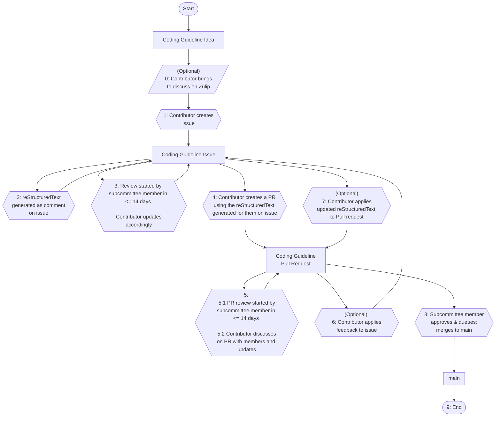

# Contributing to the coding guidelines

- Looking for the review process? That's in [REVIEWING.md](REVIEWING.md).
- Want to [open an issue](https://github.com/rustfoundation/safety-critical-rust-coding-guidelines/issues)?
- Want to write a Safety Critical Rust Coding guideline? You're in the right place.

## Contribution Workflow

If you are new here, this is the shortest path to a first PR. Expand the diagram if you want a high-level view.

<details>
<summary>Workflow diagram</summary>


```mermaid
flowchart TD
  Start(["Start"]) --> Idea["Coding Guideline Idea"]
  Idea --> Zulip[/"(Optional)<br>0: Contributor brings <br> to discuss on Zulip"/]
  Zulip --> CreateIssue{{"1: Contributor creates <br> issue"}}
  CreateIssue --> Issue["Coding Guideline Issue"]

  S2{{"2: reStructuredText <br> generated as comment <br> on issue"}} --> Issue
  Issue --> S2

  S3{{"3: Review started by subcommittee member in <= 14 days <br><br> Contributor updates accordingly"}} --> Issue
  Issue --> S3

  Issue --> S4{{"4: Contributor creates a PR using the reStructuredText generated for them on issue"}} --> PR["Coding Guideline<br>Pull Request"]

  S5{{"5: <br> 5.1 PR review started by subcommittee member in <= 14 days <br><br> 5.2 Contributor discusses on PR with members and updates"}} --> PR
  PR --> S5

  PR --> S6{{"(Optional) <br> 6: Contributor applies feedback to issue"}} --> Issue
  Issue --> S7{{"(Optional)<br> 7: Contributor applies updated reStructuredText to Pull request"}} --> PR
  PR --> S8{{"8: Subcommittee member <br> approves & queues;<br>merges to main"}} --> Main[[main]]
  Main --> End(["9: End"])
```

</details>

### 1) (Optional) Bring your idea up for discussion

If you want to discuss the feasibility of a guideline or discuss it with others, drop by the [Safety-Critical Rust Consortium's Zulip stream](https://rust-lang.zulipchat.com/#narrow/channel/445688-safety-critical-consortium) and start a discussion topic.

### 2) Open a new coding guideline issue

The Safety Critical Rust Coding guidelines has the same chapter layout as the [Ferrocene Language Specification](https://spec.ferrocene.dev/) (FLS). To contribute a new guideline, find the relevant section from the FLS, then write a guideline in the corresponding chapter of the coding guidelines.

1. Before you begin, make sure you agree to the [Licensing clause](#licenses) and [code of conduct](CODE_OF_CONDUCT.md).

2. Find the [FLS paragraph](https://rust-lang.github.io/fls/) which the guideline is covering by inspecting the page in your web browser, and looking for something like:

    ```html
    <p><span class="spec-paragraph-id" id="fls_4rhjpdu4zfqj">4.1:1</span>
    ```

    In this example, the FLS ID is `fls_4rhjpdu4zfqj`.

3. Add a new coding guideline, open a [coding guideline issue](https://github.com/rustfoundation/safety-critical-rust-coding-guidelines/issues/new?template=CODING-GUIDELINE.yml). You'll need the FLS ID from the previous step.


A GitHub Action will automatically add a comment to your newly created issue with
the contents of the coding guideline prepared written out correctly
in reStructuredText.

Note that if you later update the body of the coding guideline issue this will
fire the GitHub Action again and update the original comment with the new
contents converted to reStructuredText.

### 3) Improve the draft with a consortium Member

Within 14 days of your submission, a member of the Coding Guidelines Subcommittee should give you a first review. You'll work with them (and other members) to flesh out the concept and ensure the guideline is well prepared for a Pull Request.

> [!TIP]
> A reviewer is automatically assigned from the pool of Producers using a round-robin system. See [REVIEWING.md](REVIEWING.md) for reviewer bot details.

When a subcommittee member adds the `sign-off: create pr` label, the issue review is considered complete and reviewer reminders stop.

### 4) Create the PR from the draft

Before turning an issue into a PR, make sure that:

* The new rule isn't already covered by another rule.
* The new rules is linked to any other related rules.
* All sections contain some content.
* All content is correct. Content written may be *incomplete*.
* `🧪 Code Example Test Results` section shows all example code compiles.

As soon as these prerequisites are fulfilled, a committee member will label the issue as `sign-off: create pr`:

1. Create a Pull Request with your Guideline, using the bot comment containing the generated reStructuredText form of your guideline. All the steps necessary to link the new guidelines should appear below the headings `📁 Target Location` and `🗂️ Update Chapter Index` in the bot comment.
2. Make sure to include the line `closes #xyz` where `xyz` is your issue number.

Further discussion about the amount and correctness of its content shall then be done on the Pull Request itself.

### 5) Iterate on Feedback

The generated Pull Request may attract additional feedback or simply be an easier place to suggest targeted edits.
As the contributor of the coding guideline and opener of the issue, you'll respond to comments, discuss, all the normal things on the pull request.

- If you you're comfortable editing reStructuredText, you can apply feedback directly in the PR.
- If you'd rather make revisions in Markdown, edit the original issue, and and regenerate the reStructuredText that way. You'll have to copy the changes to the PR.

Once the coding guideline contents have passed review, a subcommittee member will approve the pull request, and put it on the merge queue.

### Licenses

There is no Contributor License Agreement to sign to contribute this project.
Your contribution will be covered by the license(s) granted for this
repository, commonly MIT, Apache, and/or CC-BY, but could be a different
license. In other words, your contribution will be licensed to the Foundation
and all downstream users under those licenses. You can read more in the
Foundation's [intellectual property policy][ip-policy].

[ip-policy]: https://foundation.rust-lang.org/policies/intellectual-property-policy/
