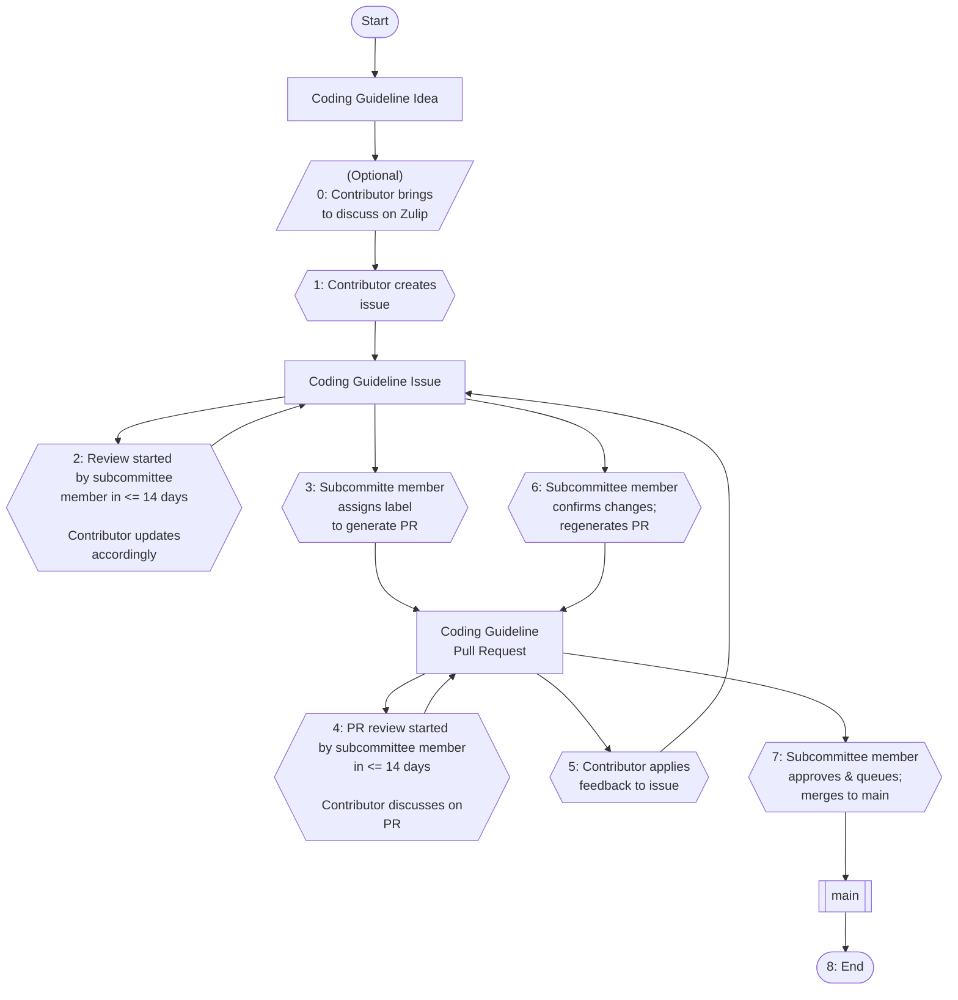

# Safety-Critical Rust Coding Guidelines

Coding Guidelines for Safety Critical Rust developed by the [Safety Critical Rust Consortium][safety-critical-rust-consortium].

[View the latest rendered guidelines online](https://coding-guidelines.arewesafetycriticalyet.org/)

Check out the [coding guideline goals](GOALS.md).

_Note_: Early, subject to changes.

## Table of Contents
- [Building the coding guidelines](#building-the-coding-guidelines)
   - [Running builds offline](#running-builds-offline)
   - [Build breaking due to out-dated spec lock file](#build-breaking-due-to-out-dated-spec-lock-file)
   - [Continuing work while on a feature branch](#continuing-work-while-on-a-feature-branch)
   - [If you need to audit the difference](#if-you-need-to-audit-the-difference)
- [Outline \& issue breakdown](#outline--issue-breakdown)
- [Contributing to the coding guidelines](#contributing-to-the-coding-guidelines)
   - [Diagram for contribution workflow](#diagram-for-contribution-workflow)
   - [0. Have an idea for a coding guideline? Want to discuss it?](#0-have-an-idea-for-a-coding-guideline-want-to-discuss-it)
   - [Preamble: chapter layout mirrors Ferrocene Language Specification](#preamble-chapter-layout-mirrors-ferrocene-language-specification)
   - [1. Submit coding guideline issue](#1-submit-coding-guideline-issue)
   - [1.a Finding the FLS ID](#1a-finding-the-fls-id)
   - [2. A subcommittee member reviews the coding guideline issue, works with you the contributor](#2-a-subcommittee-member-reviews-the-coding-guideline-issue-works-with-you-the-contributor)
   - [3. A pull request is generated from the coding guideline issue](#3-a-pull-request-is-generated-from-the-coding-guideline-issue)
   - [4. Contributor responds to feedback given on pull request](#4-contributor-responds-to-feedback-given-on-pull-request)
   - [5. Contributor applies updates to coding guidelines issue](#5-contributor-applies-updates-to-coding-guidelines-issue)
   - [6. A subcommittee member generates new pull request contents from coding guidelines issue](#6-a-subcommittee-member-generates-new-pull-request-contents-from-coding-guidelines-issue)
   - [7. A subcommittee member merges the coding guideline pull request](#7-a-subcommittee-member-merges-the-coding-guideline-pull-request)
   - [8. You contributed a coding guideline](#8-you-contributed-a-coding-guideline)
- [Writing a guideline locally (less typical, not recommended)](#writing-a-guideline-locally-less-typical-not-recommended)
   - [Guideline template](#guideline-template)
- [Code of Conduct](#code-of-conduct)
- [Licenses](#licenses)
- [Other Policies](#other-policies)

## Building the coding guidelines

The Safety-Critical Rust Coding Guidelines use `Sphinx` and `Sphinx-Needs` to build a rendered version of the coding guidelines, and `uv` to install and manage Python dependencies (including Sphinx itself). To simplify building the rendered version, we created a script called `make.py` that takes care of invoking Sphinx with the right flags.

If you still need to install `uv` you can follow the [steps outlined](https://docs.astral.sh/uv/getting-started/installation/) on Astral's website.

You can build the rendered version by running:

On Linux-like systems:

```shell
   ./make.py
```

On Windows systems:

```shell
   uv run make.py
``` 

By default, Sphinx uses incremental rebuilds to generate the content that
changed since the last invocation. If you notice a problem with incremental
rebuilds, you can pass the `-c` flag to clear the existing artifacts before
building:

```shell
   ./make.py -c
```

The rendered version will be available in `build/html/`.

A machine-parseable artifact will be available at `build/html/needs.json`. (ToDo: Pete LeVasseur) The `needs.json` file could use some cleaning up and some description here of the contents.

A record with checksums of the contents is available at `build/html/guidelines-ids.json`. Users of the coding guidelines can reference this file to determine if there have been changes to coding guidelines contents they should be aware of.


### Running builds offline

If you're working without internet access or want to avoid reaching out to remote resources, you can pass the `--offline` flag:

```shell
   ./make.py --offline
```

This prevents the build system from attempting to fetch remote resources, such as updates to the specification. Use this flag when you need reproducible or air-gapped builds.

It is recommended to use `--offline` if you are running `make.py` frequently during development. The builder fetches data from [the Ferrocene Language Specification website](https://spec.ferrocene.dev/paragraph-ids.json), which may rate-limit repeated requests—leading to delays or failed builds. Using `--offline` can significantly improve build speed and avoid unnecessary network issues during iterative work.


### Build breaking due to out-dated spec lock file

It's a fairly common occurrence for the build to break due to an out of date spec lock file, located at:

```
src/spec.lock
```

The `spec.lock` is checked against the current live version of the specification, which means that your local development may go out of date while you are developing a feature.

### Continuing work while on a feature branch

If you run into this while developing a feature, you may ignore this error by running the build with:

```shell
   ./make.py --ignore-spec-lock-diff
```

### If you need to audit the difference

When the build breaks due to the difference a file is created here:

```
/tmp/fls_diff_<random>.txt
```

which can be used to aid in auditing the differences.

Follow the below steps to ensure that the guidelines remain a representation of the FLS:

1. Check if there are any guidelines currently affected, if no, go to 6.
2. For each affected guideline, audit the previous text and current text of the appropriate paragraph-id in the FLS
3. If the prior and new text of that paragraph in the FLS does not effect the guideline, proceed back to 2. to the next affected guideline
4. If the prior and new text of that paragraph do differ in the FLS, then a rationalization step is required
   1. In the rationalization step, either yourself or another coding guidelines member must modify the guideline to comply with the new text
5. If you any affected coding guidelines remain proceed back to 2. to the next affected guideline
6. You are done

Once you have completed the above steps, you will now update the local copy of the `spec.lock` file with the live version:

```shell
   ./make.py --update-spec-lock-file
```

Open a new PR with only the changes necessary to rationalize the guidelines with the new FLS text.

## Outline & issue breakdown

We will use the Coding Guidelines Work Items [board](https://github.com/orgs/rustfoundation/projects/1) as a means to break the work down into smaller chunks that can be tackled in a reasonable manner.

## Contributing to the coding guidelines

See [CONTRIBUTING.md](CONTRIBUTING.md).

### Diagram for contribution workflow



### 0. Have an idea for a coding guideline? Want to discuss it?

While not mandatory, sometimes you'd like to check into the feasiblity of a guideline or discuss it with others to ensure it's not overlapping an existing guideline. Feel free to drop by the Safety-Critical Rust Consortium's Zulip stream: [here](https://rust-lang.zulipchat.com/#narrow/channel/445688-safety-critical-consortium). Please open a new topic per coding guideline you'd like to discuss.

### Preamble: chapter layout mirrors Ferrocene Language Specification

We have the same chapter layout as the [Ferrocene Language Specification](https://spec.ferrocene.dev/) (FLS). If you would like to contribute you may find a section from the FLS of interest and then write a guideline in the corresponding chapter of these coding guidelines.

### 1. Submit coding guideline issue

For a new coding guideline you'd like to contribute, start with opening a [coding guideline issue](https://github.com/rustfoundation/safety-critical-rust-coding-guidelines/issues/new?template=CODING-GUIDELINE.yml).

#### 1.a Finding the FLS ID

Note that the FLS ID should be filled according to the FLS paragraph ID for which the guideline is covering. One way to go about finding this is to inspect the page using your web browser. You'll be looking for something like:

```html
<p><span class="spec-paragraph-id" id="fls_4rhjpdu4zfqj">4.1:1</span>
```

You would then pull `fls_4rhjpdu4zfqj` to place in the FLS ID field.

### 2. A subcommittee member reviews the coding guideline issue, works with you the contributor

A member of the Coding Guidelines Subcommittee should get you a first review with some feedback within 14 days of submission. You'll work with one or more members to flesh out the concept and ensure the guideline is well prepared.

### 3. A pull request is generated from the coding guideline issue

Once an issue has been well-developed enough, a subcommittee member will mark the issue with the label `sign-off: create pr from issue` to generate a pull request. You will see a GitHub Workflow trigger and a pull request will be created momentarily.

### 4. Contributor responds to feedback given on pull request

The generated pull request may attract additional feedback or simply be an easier place to suggest targeted edits.

As the contributor of the coding guideline and opener of the issue, you'll respond to comments, discuss, all the normal things on the pull request.

### 5. Contributor applies updates to coding guidelines issue

If you agree with the suggested changes, rather than making changes on the opened pull request, you will return to the original issue you opened via the coding guideline issue template and make the updates there.

### 6. A subcommittee member generates new pull request contents from coding guidelines issue

When you have completed all feedback given to you, ping one of the subcommittee members. They will then remove and affix the label `sign-off: create pr from issue` to push the changes made in the issue to the already opened pull request.

### 7. A subcommittee member merges the coding guideline pull request

Once the coding guideline contents have passed review, a subcommittee member will approve the pull request, and put it on the merge queue to be merged.

### 8. You contributed a coding guideline

That's it!

## Writing a guideline locally (less typical, not recommended)

While it is possible to create guidelines locally and open pull requests yourself, we encourage contributors to make use of the process described above since it handled some of the fiddly details for you as a guideline writer.

Generally speaking, pull requests for guidelines which do not follow the issue to pull request workflow described above will be closed with a recommendation to follow the workflow.

### Guideline template

We have a script `./generate_guideline_templates.py` which assumes you're using `uv` that can be run to generate the template for a guideline with properly randomized IDs.

You can the copy and paste this guideline from the command line into the correct chapter.

## [Code of Conduct][code-of-conduct]

The [Rust Foundation][rust-foundation] has adopted a Code of Conduct that we
expect project participants to adhere to. Please read [the full
text][code-of-conduct] so that you can understand what actions will and will not
be tolerated.

## Licenses

Rust is primarily distributed under the terms of both the MIT license and the
Apache License (Version 2.0), with documentation portions covered by the
Creative Commons Attribution 4.0 International license..

See [LICENSE-APACHE](LICENSE-APACHE), [LICENSE-MIT](LICENSE-MIT), 
[LICENSE-documentation](LICENSE-documentation), and 
[COPYRIGHT](COPYRIGHT) for details.

You can also read more under the Foundation's [intellectual property
policy][ip-policy].

## Other Policies

You can read about other Rust Foundation policies in the footer of the Foundation
[website][foundation-website].

[code-of-conduct]: https://foundation.rust-lang.org/policies/code-of-conduct/
[foundation-website]: https://foundation.rust-lang.org
[ip-policy]: https://foundation.rust-lang.org/policies/intellectual-property-policy/
[media-guide and trademark]: https://foundation.rust-lang.org/policies/logo-policy-and-media-guide/
[rust-foundation]: https://foundation.rust-lang.org/
[safety-critical-rust-consortium]: https://github.com/rustfoundation/safety-critical-rust-consortium
